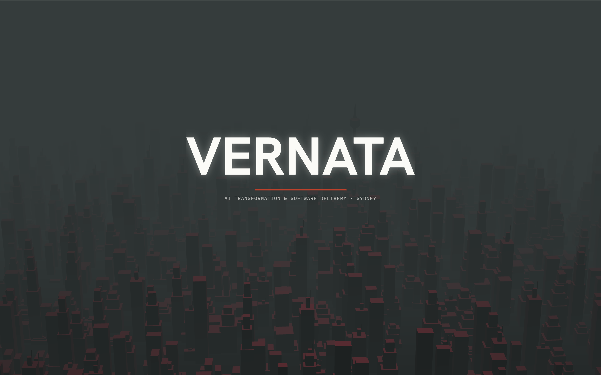
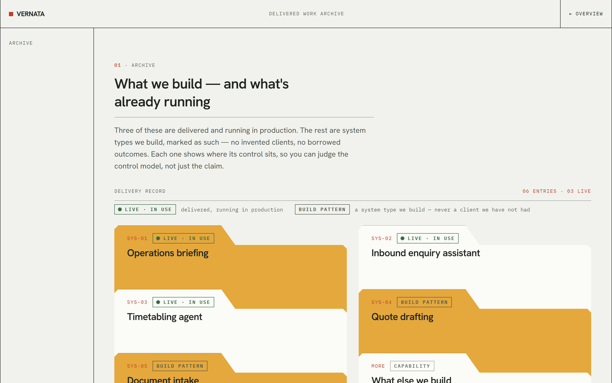
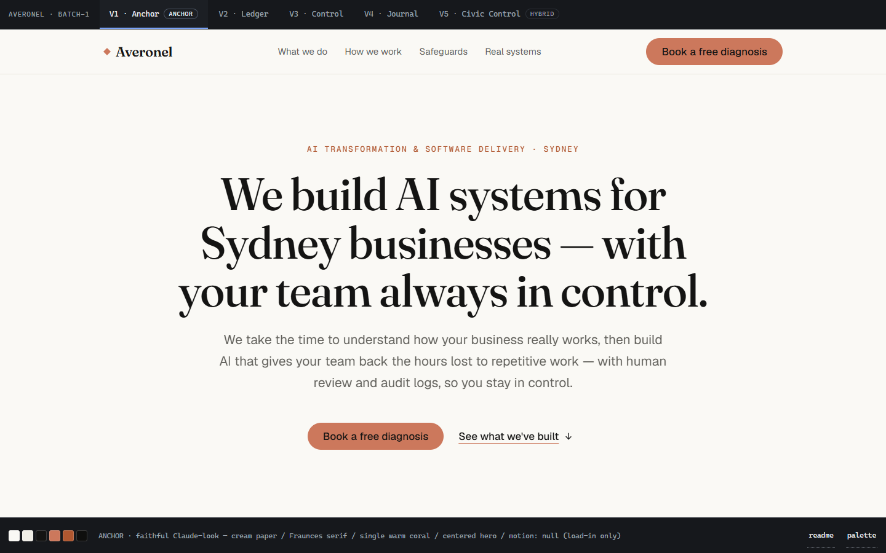
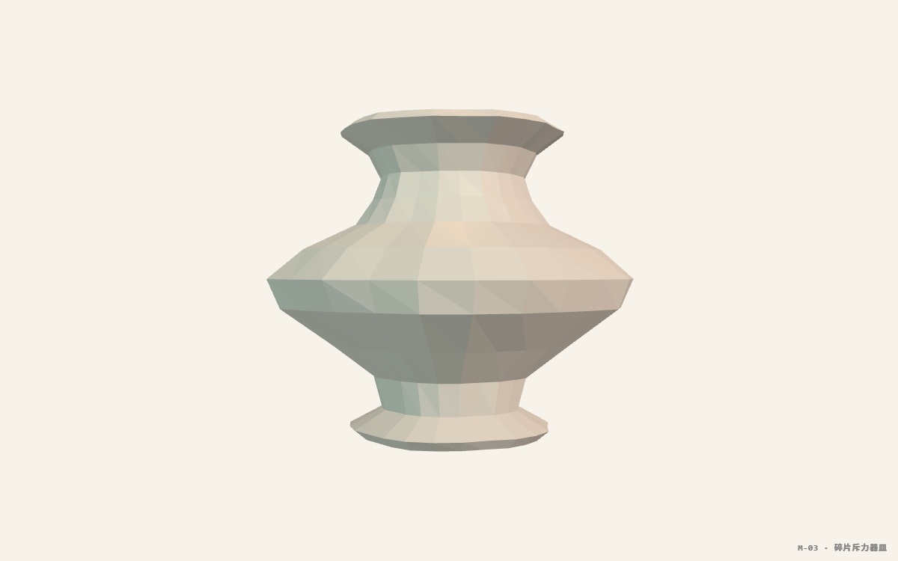
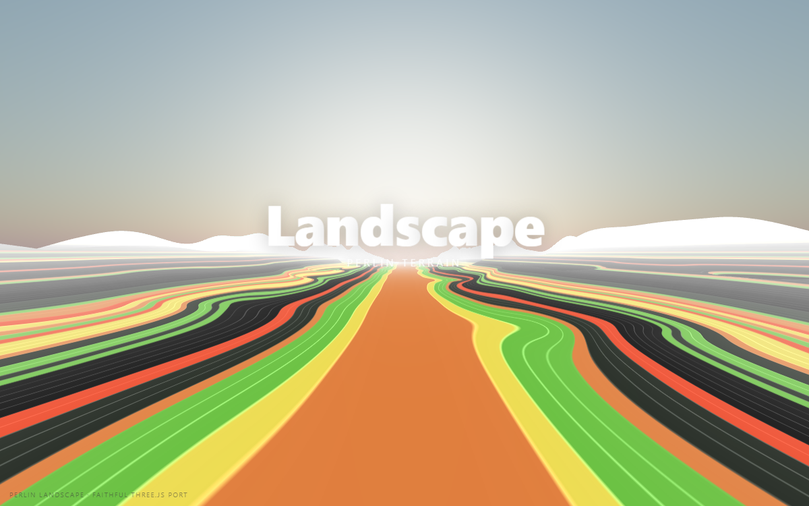
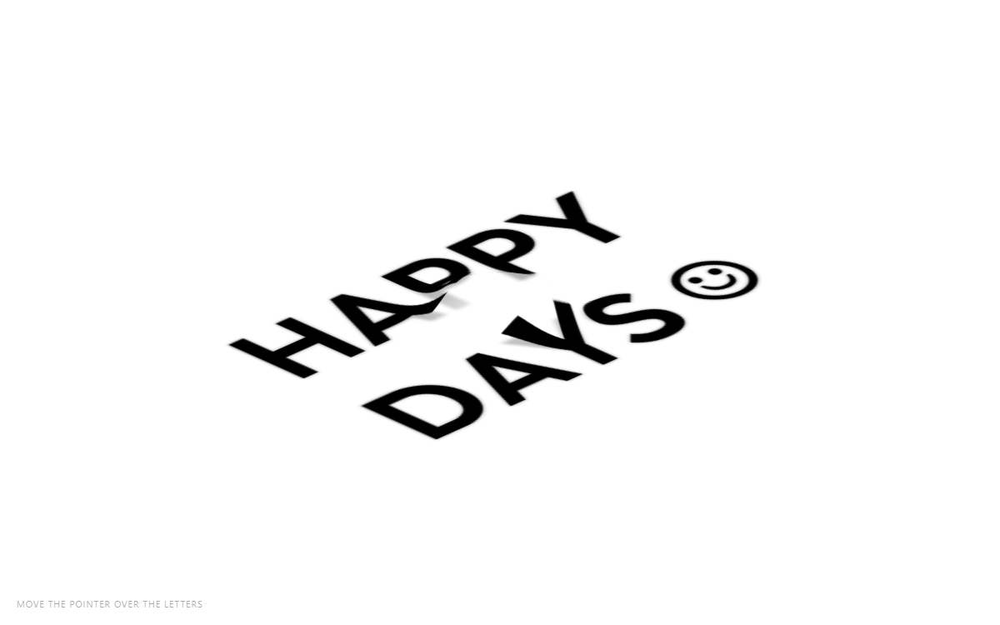
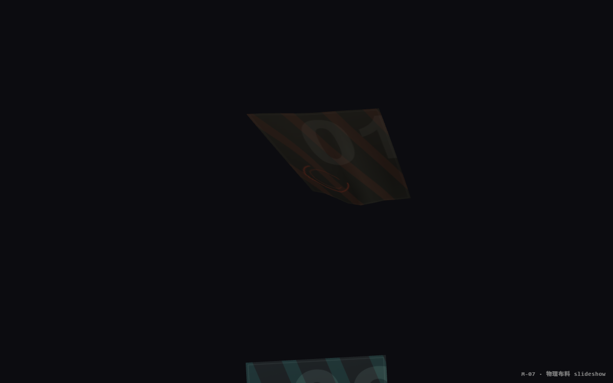

# UI Direction Lab

**A design pipeline that turns one line of product intent into a locked design system and a full set of production-grade pages** — built as Claude Code skills, with a deterministic gate and a named human decision at every step.

The premise: taste is not automatable, but everything around it is. Machines check that the code is correct, that it obeys the locked design chassis, and that nothing drifted since it was last verified. *Which direction is good* stays a human call — at named decision points (nine on the main line, two more once motion is engaged, two more if the IA companion runs), not implicitly buried in a prompt.



---

## What has been built with it

### Vernata — marketing site for an AI delivery studio

Three pages produced end-to-end by the pipeline: a home page with a WebGL systems gallery, a delivered-work page, and a booking page wired to a Cloudflare Pages Function and a transactional email backend. Design tokens are a single locked chassis shared across all three.

Production-ready; awaiting a domain. Repo: `Melclycj/landing_page` (private).



Same pipeline, a deliberately different register from the hero above: a warm editorial archive instead of a dark WebGL stage. Neither look is a template — each direction was picked from generated variants, then frozen into a chassis every page inherits.

### Averonel — enterprise AI integration, marketing register

A complete marketing site built as the pipeline's end-to-end evaluation run: information architecture round 1 → visual direction exploration → chassis lock → motion architecture → surface wave, with the evaluation findings recorded against each stage rather than asserted.



**This is the review surface, and it is where the method lives.** The top bar switches between the five generated directions — `Anchor`, `Ledger`, `Control`, `Journal`, `Civic Control` — so they are judged against each other rather than in isolation. The bottom bar carries each variant's rationale and palette as data, not prose: *cream paper / Fraunces serif / single warm coral / centered hero / motion: null*. You pick one. That choice becomes the chassis, and every page produced afterwards is validated against it.

### The material library — 55 verified front-end modules

Scroll-driven WebGL scenes, shader transitions, physics slideshows, layout-FLIP choreography, pointer-reactive grids. Each one is a single applyable module plus a demo that consumes that same module — **never a second implementation** — with a machine-checked receipt proving the shipped code is byte-identical to what was verified.

Seven of them are in production use on the Vernata site.

| | |
|---|---|
|  |  |
|  |  |
|  |  |

*Six of fifty-five. Every frame above was captured by running the module's own demo — the same file a consuming page imports.*

> **⚠ The library is not part of the plugin.** Installing `ui-design-pipeline` gets you the
> pipeline, not these 55 modules — they live in the private lab. This is deliberate: the
> library grows in batches while the pipeline's 21 skills stay stable, so tying them to one
> version number would mean bumping the pipeline every time a module lands. A separate
> `ui-material-library` package in this same marketplace is planned, gated on a per-piece
> provenance pass; two of the original 57 have already been withdrawn on licence grounds.
>
> **What you lose without it:** an optional pre-filter that picks candidate modules by
> content shape. It is off by default, and when the corpus is absent the resolver says so
> and refuses rather than quietly returning nothing. The pipeline itself predates the
> library by two weeks and was built to run without it — the mechanism pools that drive the
> design decisions all ship with the plugin. What you don't get is ready-made code to reuse.

---

## How the pipeline works

`●` = you decide. Everything else runs unattended.

```
[one line of product intent]
   │
   │   ┌ IA ROUND 1 · optional, for anything past a single screen ──────────┐
   │   │ Normalise whatever you have — a feature list, rough sections, or a │
   ├───┤ paragraph of intent — into a whole-product info-spec plus a        │
   │   │ grey-box review board.                                             │
   │   │ ● you approve INFORMATION STRUCTURE. Grey on purpose: you judge    │
   │   │   what each screen holds and what dominates, not how it looks.     │
   │   └────────────────────────────────────────────────────────────────────┘
   │     the hero screen's spec enters the main line as a hard constraint
   ▼
Stage 0 · intent Q&A ............... ● 4 questions, all defaultable
   ▼
gate #0 ............................ ● a reference to work from,
                                       or open exploration?
   ▼
BATCH 1 · 3–4 visual directions .... ● pick the LEAD
  the exploration branch always
  includes one ANCHOR — a faithful
  rebuild of a real product, there
  to keep the others honest
   ▼
contrast gate · WCAG computed ...... ● fix, or accept knowingly — the ratio
  per text-role token pair,            is written down, because that debt is
  before anything is frozen            inherited by every page produced later
   ▼
BATCH 2 · 2–3 motion stances ....... ● pick one
  visual frozen pixel-identical
  to the LEAD
   ▼
LOCK THE CHASSIS → tokens + CHASSIS.md
   │
   │   ┌ IA ROUND 2 · same swimlane, now that composition is settled ───────┐
   ├───┤ Generalise the locked composition pattern to every remaining       │
   │   │ screen as grey-box wireframes — flag gaps, never invent content.   │
   │   │ ● Stage-F gate: you walk them                                      │
   │   └────────────────────────────────────────────────────────────────────┘
   │     wireframes become the wave's production_source: colour only,
   │     never re-layout
   ▼
● Sectional Score .................. at most one bounded section
                                       choreography — or skip, which is
                                       the default answer
   ▼
● lock → wave ...................... an explicit approval word; a hook
                                       blocks the fan-out without it
   ▼
SURFACE WAVE · N pages in parallel
  each page: validate → score →      ● you are interrupted only when a page
  fix-on-fail, up to 3 retries         still fails after the third try
   ▼
● Atomic Pass ...................... you approve a BUDGET — how many targets,
                                       which properties — not each effect
   ▼
● accept the gallery
   │
   └─►optional, on request: audit & polish ║ visual regression ║ certification
```

**One axis per batch.** Visuals change, then freeze; then motion changes. Deliberate — it is
what stops the review becoming a combinatorial mess where you cannot tell which change you
are reacting to.

**Motion is chosen widest-first, and the order is enforced.** Page-level mechanism, then
bounded section choreography, then small effects on components that already exist — held by
an irreversible state machine (`CHASSIS_OPEN → CHASSIS_LOCKED → SECTIONAL_OPEN →
SECTIONAL_LOCKED → BASE_WAVE_READY → ATOMIC_OPEN → COMPLETE`) that only advances on a
recorded approval of yours. Once the chassis locks, a page-level mechanism can never be
introduced later; the production wave is barred from improvising small effects at all, and
a preflight plus a hook stop it from starting early.

**The IA companion is what makes this work past one screen.** Skip it for a single landing
page. For anything with several screens it runs twice — settling *what information each
screen holds and what dominates* before any visual work exists to bias you, then, after the
chassis locks, generalising that approved composition to the rest so the wave colours
wireframes you already signed off rather than inventing layouts page by page.

---

## What the machine actually guarantees about the UI

Generating a page is the easy half. The hard half is that a model asked for "a modern
landing page" will reliably produce the same page — centred hero, purple-blue gradient,
emoji bullets, a palette that drifts warm on one section and cool on the next. This
pipeline treats those as **failures with names**, checked by code, not as taste notes
someone might remember to apply.

Every produced surface runs a validator that returns `BLOCK` / `FIX_NEEDED` / `PASS`.
The ones that matter visually:

| Enforced | What it stops |
|---|---|
| **Contrast, computed before the lock** | Every text-role token pair is run through WCAG *before* the design system is frozen. Failures come back as a list of specific pairs. You may accept one knowingly — and the ratio is written into `CHASSIS.md`, because that debt is inherited by every page produced afterwards. |
| **Gradients banned unless allowlisted** | Any `linear-gradient` / `radial-gradient` outside a semantic allowlist blocks the page. This is the single most recognisable tell of generated design, so it is a gate, not advice. |
| **Accessibility floor blocks, not warns** | A `<button>` with no accessible name, an `<input>` with no label or `aria-label`, or any declared motion without a `prefers-reduced-motion` fallback — each stops the page. |
| **You get the pattern you claimed** | A surface declared as an overlay must actually contain a panel *and* a scrim; a drawer must carry an anchor-side rule. A page cannot claim a UI pattern it did not build. |
| **Named anti-slop rules** | Enforced by a red-team pass, quoting its own wording: *"the AI Purple/Blue aesthetic is strictly BANNED — no purple button glows, no neon gradients"*; no emoji anywhere including alt text; one palette per project, no drifting between warm and cool greys; centred heroes banned above a layout-variance threshold. |
| **Content is grounded, not invented** | A surface built from a production source is checked against it. Mock links are labelled as mock rather than looking real. |

Behind those sits the part you never see: the lock from design system to page production
is held by a **hook, not an instruction** — the model may propose skipping a step, but it
cannot act on that until you answer with an explicit approval word. That one became code
after instructions alone were measured to be insufficient.

**129 automated checks** cover the machinery itself: 97 pipeline assertions, 16 production
test functions, 16 information-architecture fixtures. All green from a clean install.

### Honest boundaries

Stated up front, because a tool that overstates itself is worse than one that does less:

- **Whether it looks good is always a human call.** Scorers guarantee "written correctly, obeys the chassis" — nothing more.
- **A validator cannot see inside a `<canvas>`.** WebGL surfaces are machine-checked for console errors, leaks and API misuse; how they *feel* must be watched with human eyes.
- **Variants are review prototypes, not production code.** Cross-page links are mocked and labelled as such.
- One run serves one register. A marketing site and an app console are two runs and two chassis.

---

## Install

```
/plugin marketplace add Melclycj/ui-direction-lab
/plugin install ui-design-pipeline@ui-direction-lab
```

21 skills, 1.4 MB, ~3.2k tokens of always-on context. Requires Python ≥ 3.9 — standard library only, no pip packages.

Then say *"give me a few UI directions"*. You need one line describing the product; the pipeline asks for the rest in order.

Third-party skills this pipeline calls — GreenSock's GSAP set, Anthropic's `frontend-design`, and four others — are **nominated rather than redistributed**: each call site names how to install it from its own source, and what degrades if you don't. Details in [`plugins/ui-design-pipeline/README.md`](plugins/ui-design-pipeline/README.md).

---

## Repository map

| Path | What it is |
|---|---|
| `plugins/ui-design-pipeline/` | The distributable plugin — 21 skills, the approval hook, its own README |
| ├ `core/` | The two engines: direction exploration, then chassis-locked production |
| ├ `companions/` | Information architecture, an anti-slop taste red-team, a ~165-system design-system catalog, audit and visual-regression companions |
| ├ `extensions/` | Opt-in add-ons to the production wave: dark mode, atom pages, version snapshots |
| └ `three/` | 11 Three.js / WebGL skills (10 vendored MIT + 1 original) |
| `docs/media/` | The screenshots above — captured by running each thing, not mocked up |

Only `plugins/` is installed. The showcase assets sit outside it on purpose: a plugin
install copies the whole plugin directory and ignores `.gitignore`, so 1.8MB of
screenshots would otherwise land on every installer's disk.

### Where this comes from

This repository is the published face of a working lab that stays private. The lab holds
what a published package should not: the 55-piece material corpus with its demos and
verification receipts, third-party skills kept for local use and deliberately not
redistributed, and a work ledger that quotes its author and names clients.

Everything here is generated from the lab by a one-way sync; nothing is edited here
directly.

---

## Status

Actively developed. The pipeline and the material library are in daily use; the plugin packaging landed in August 2026. The two sites above are complete and awaiting deployment.

Licensed MIT — see [`LICENSE`](LICENSE). Third-party provenance is recorded per piece; vendored groups carry their upstream terms verbatim rather than a restated summary.
