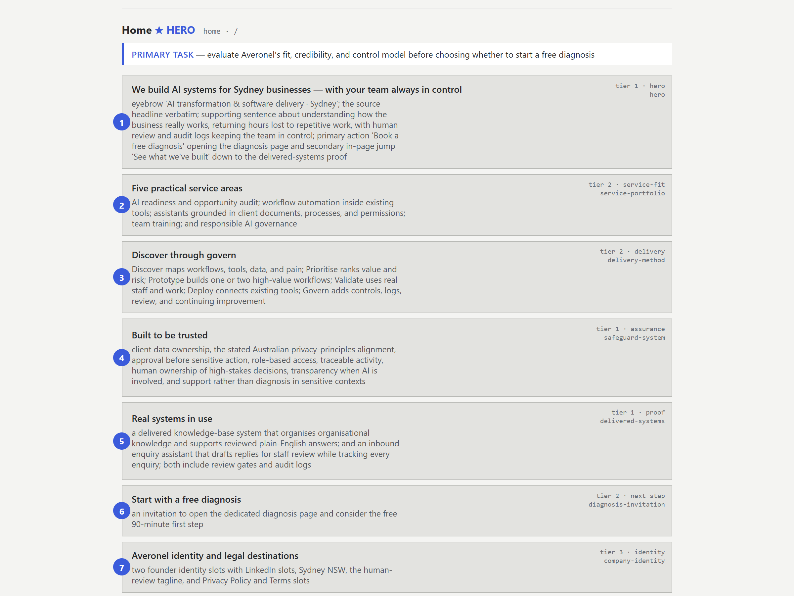
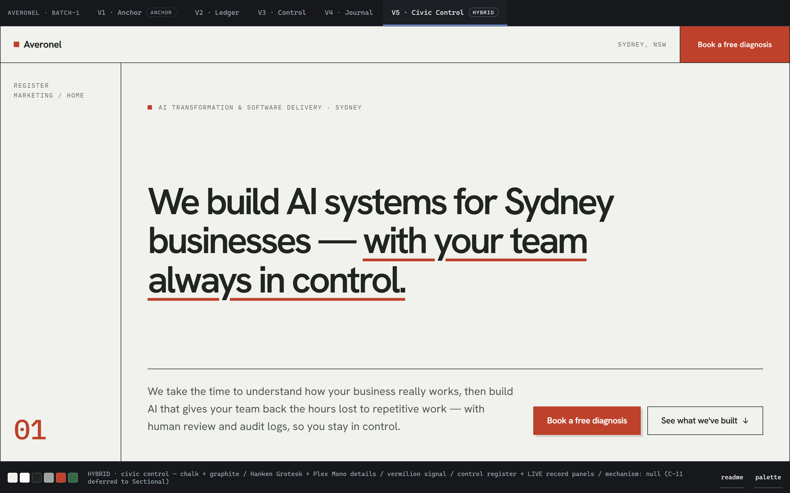
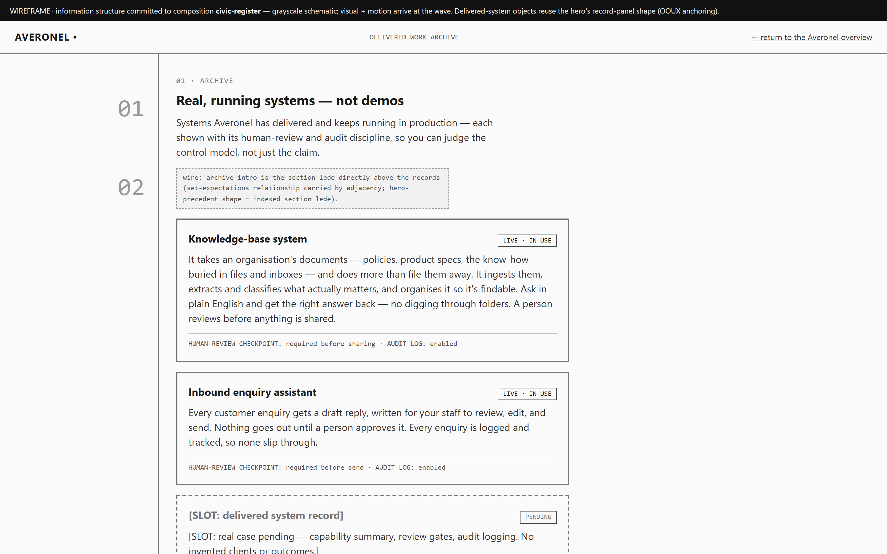
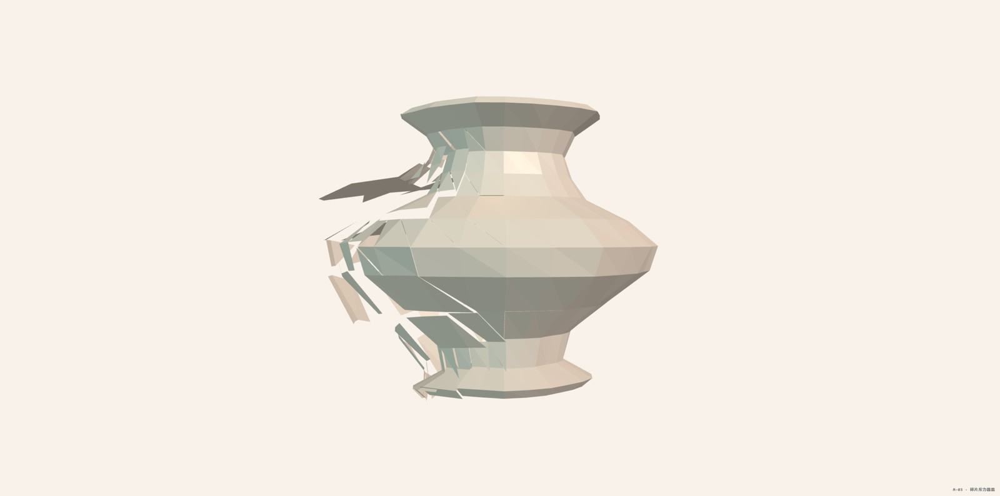
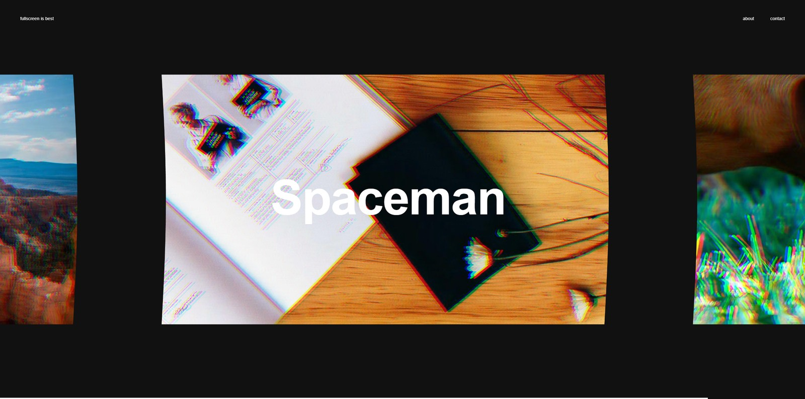
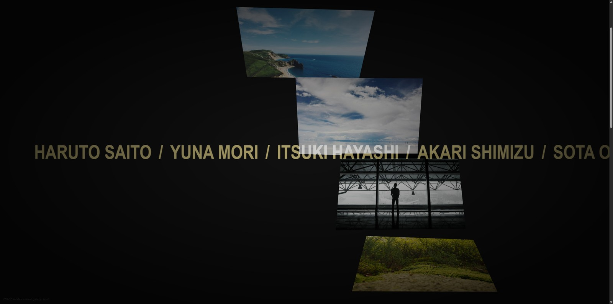
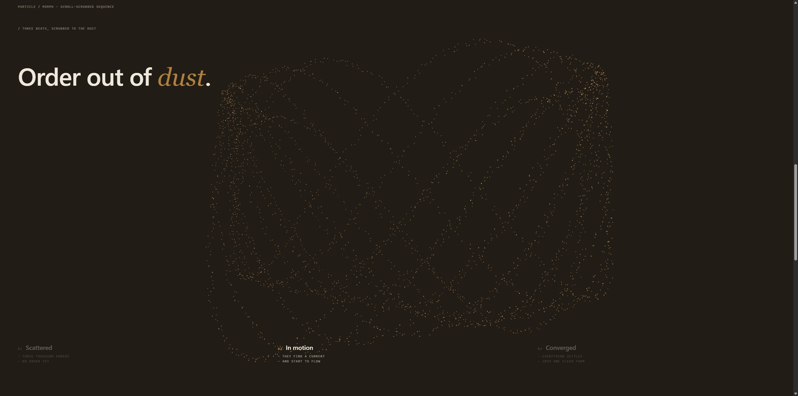

[English](README.md) | **简体中文**

# UI Direction Lab

**一句话的产品意图进去，一套锁死的设计系统和一整组能上线的页面出来。** 整条流水线由 Claude Code
skills 搭成，每一步都卡着一道确定性的门，和一个签了名的人类决策。

前提是这样的：品味没法自动化，品味以外的事全都可以。代码写得对不对、有没有守住锁定的 design
chassis、上次验证之后有没有偷偷漂移 —— 这些交给机器。**哪个方向好看**这件事永远由人拍板，而且拍板的
地方都有名字（主线 9 处，动效介入后多 2 处，跑 IA companion 再多 2 处），不会含混地埋在某段 prompt 里。


---

## 用它做出了什么

### Vernata —— 一家 AI 交付工作室的营销站

三个页面全程由流水线产出：带 WebGL 系统画廊的首页、交付案例页、以及接了 Cloudflare Pages Function
和事务邮件后端的预约页。三页共用同一套锁定的 design token chassis。

站已经能上线，就差一个域名；它的仓库没有公开。下面
[一次运行长什么样](#一次运行长什么样) 拍的就是这个站 —— 那一节里每一张图都是建它的过程中留下的。

---

> **安装** · `/plugin marketplace add Melclycj/ui-direction-lab`，然后
> `/plugin install ui-design-pipeline@ui-direction-lab` —— 22 个 skill，要 Python ≥ 3.9，
> 只用标准库。[完整说明在下面。](#安装)

---

## 流水线怎么运转

三个 skill 扛完整条流程，而它们之间那条分界线本身就是整个设计：

- **`information-architecture`** 定的是*这一屏上有哪些信息、谁最大* —— 区块、tier、扫视顺序、这屏要
  服务的任务、跨屏链接图。它**刻意不碰排版**：东西放哪儿它不决定，还专门有 lint 抓这个决定的泄漏。
  因为排版是你的选择，只是要晚一个阶段才轮到。
- **`prototyping-ui-directions`** 把*排版和视觉捆在一起变* —— 侧栏还是顶栏、表格还是 bento，连同字体、
  配色、动效 —— 做成几个互相竞争的完整方向让你挑。你挑中的那个直接冻成 chassis：tokens、composition
  pattern、动效立场。
- **`anchor-prototype-wave`** 拿着这套冻好的 chassis 并行铺完剩下所有页面，一页一校验、一页一自修。

IA **要跑两遍**，第二遍正是第三个 skill 敢并行的前提：它把你刚锁定的 composition 推广成灰盒
wireframe，覆盖那些还没人设计过的屏。这些 wireframe 成了 wave 的 `production_source`，而对着这种
source，wave **不许重新排布任何东西** —— 它只上色，不排版。省掉第二遍，每个页面都会自己发明一套布局，
产品也就不成其为一个产品了。只有单屏的运行才有资格跳过。

剩下的部分都是门。`●` 表示这一步你来决定，其余全程无人值守。

> 图里的阶段名保持英文 —— 那些是 skill 内部用的标识符，翻成中文反而对不上。

```
[one line of product intent]
   │
   │   ┌ IA ROUND 1 · optional, for anything past a single screen ──────────┐
   │   │ Normalise whatever you have — a feature list, rough sections, or a │
   ├───┤ paragraph of intent — into a whole-product info-spec plus a        │
   │   │ grey-box review board.                                             │
   │   │ ● you approve INFORMATION STRUCTURE. Grey on purpose: you judge    │
   │   │   what each screen holds and what dominates, not how it looks.     │
   │   └────────────────────────────────────────────────────────────────────┘
   │     the hero screen's spec enters the main line as a hard constraint
   ▼
Stage 0 · intent Q&A ............... ● 4 questions, all defaultable
   ▼
gate #0 ............................ ● a reference to work from,
                                       or open exploration?
   ▼
BATCH 1 · 3–4 visual directions .... ● pick the LEAD
  the exploration branch always
  includes one ANCHOR — a faithful
  rebuild of a real product, there
  to keep the others honest
   ▼
contrast gate · WCAG computed ...... ● fix, or accept knowingly — the ratio
  per text-role token pair,            is written down, because that debt is
  before anything is frozen            inherited by every page produced later
   ▼
BATCH 2 · 2–3 motion stances ....... ● pick one
  visual frozen pixel-identical
  to the LEAD
   ▼
LOCK THE CHASSIS → tokens + CHASSIS.md
   │
   │   ┌ IA ROUND 2 · same swimlane, now that composition is settled ───────┐
   ├───┤ Generalise the locked composition pattern to every remaining       │
   │   │ screen as grey-box wireframes — flag gaps, never invent content.   │
   │   │ ● Stage-F gate: you walk them                                      │
   │   └────────────────────────────────────────────────────────────────────┘
   │     wireframes become the wave's production_source: colour only,
   │     never re-layout
   ▼
● Sectional Score .................. at most one bounded section
                                       choreography — or skip, which is
                                       the default answer
   ▼
● lock → wave ...................... an explicit approval word; a hook
                                       blocks the fan-out without it
   ▼
SURFACE WAVE · N pages in parallel
  each page: validate → score →      ● you are interrupted only when a page
  fix-on-fail, up to 3 retries         still fails after the third try
   ▼
● Atomic Pass ...................... you approve a BUDGET — how many targets,
                                       which properties — not each effect
   ▼
● accept the gallery
   │
   └─►optional, on request: audit & polish ║ visual regression ║ certification
```

**一批只动一根轴。** 先变视觉、冻住，再变动效。这是故意的：不然评审会变成一团组合爆炸，你根本分不清
自己是在对哪个变化做反应。

**动效是单独的一根轴，有自己的三档宽度和自己的门** —— 见下面的 [动效](#动效)。

---

## 一次运行长什么样

上面那张图，真跑一遍是什么样 —— 跑的就是 Vernata 站，那会儿产品还叫 **Averonel**。下面每一帧都是那次
运行留下来的真东西。

### 1 · 信息计划 —— IA 第一轮



**你会看到** —— 这屏要装的每个区块，一行一个，按扫视路径排（那些编号圆点），按优先级 tier 定高矮，各自
标着扮演什么角色；最上面一行是这屏存在的唯一任务。

**怎么读** —— 顺着编号从上往下过一遍，问两个问题：一个陌生人按这个顺序认识你的产品，对不对？最高的
那几个框，是不是你真希望他记住的？之所以是灰的，因为这里没有任何能打动你的东西 —— 没字体、没颜色、
没图。你要判断的只有信息本身和它的轻重。

**你得给出** —— 批准，或者挪区块、改 tier、砍掉。这是一道人类门，你不答，流程就停在这儿。

**它绑住了什么** —— 下一阶段的每个方向都得按这些 tier 装这些区块。这一步干的全部事情就是**给信息打
标记**：是什么、值多少、按什么顺序被看到。这样后面做出来的东西，强调的才是读者真正需要注意的地方。
它刻意留着不定的是*东西放哪儿* —— 那是你下一步才做的选择。

### 2 · 方向 —— 第一批，然后是动效



**你会看到** —— 几个互相竞争的完整方向，每个都是能跑的真页面，顶栏切换。底栏把当前这个的色板和理由
压成一行数据摆着。

**怎么读** —— 拿它们互相比，别拿它们跟你脑子里的理想比。其中一个是 **ANCHOR**，一个真实产品的忠实
复刻，特意留在队列里，好让生成的那几个有个像样的对手可以输。

**你得给出** —— 一个 LEAD。而且**你不必只在摆出来的这几个里挑**：可以让它把两个杂交（这次就是这么
干的，选中的第五个 tab 是评审中途要的 hybrid）；可以要某个方向的配色 / 主题 / 密度子变体 —— 它们会以
第二排 tab 出现，共用同一个文件，所以试一套配色不用重开一批；也可以整批推倒重来，换一个这五个都没
碰过的路子。这个画廊是让你继续看的地方，不是交上去就完事的表格。

锁定之前，每一对 text-role token 都会算对比度，你要么修，要么明知故犯地接受。动效是另外一次、单独的
挑选。

**它绑住了什么** —— 你挑的那个成为 chassis：tokens、动效立场、composition pattern。审批按你的原话
存档 —— 这次存的是「锁 V5 + Dossier depth，放掉 V1」。从这一刻起 composition 没得谈了，而下一步能成立，
靠的正是这个。

### 3 · 排版法 —— IA 第二轮



**你会看到** —— 那些还没人设计过的屏，用从你刚锁定的 chassis 里提出来的 composition pattern 画成灰盒。
这次这个 pattern 叫 `civic-register`：左边一条登记栏、分割线隔开的编号区段、不用卡片。所有未知的地方
都是明晃晃的 `[SLOT]`，标着 PENDING。

**怎么读** —— 这就是你要上线的那个页面，只是还没上色、没填内容。区块在这儿摆错了，上线也一样错，而
现在是挪动它最便宜的时候。

**你得给出** —— 逐屏走一遍，批准，或者指出缺什么。这个 skill 的铁律是*标出来，绝不编*：它不会为了让
wireframe 显得完整，就往空位里塞一段听着挺像回事的内容。

**它绑住了什么** —— **多页产品之所以还算一个产品，全靠这一步。** 把区块在区域之间搬家、或者换掉流程
机制，都在 wave 的禁令清单上；它只给你签过字的东西上色。没这一步，你评审的就是十二份各说各话的意见，
而不是一个产品。

### 4 · 量产 wave


**你会看到** —— 上线的页面。跟第 3 帧对一下：同一条左栏、同样的区段顺序、同样的记录面板、同样的
`LIVE · IN USE` 标。新来的只有颜色、字体和真内容。

**怎么读** —— 当成对 wireframe 的核对来看，别当成一份新设计。凡是你在灰盒阶段没见过的东西，都是从
某道门底下溜过去的。

**你得给出** —— 刻意地，几乎什么都不用给。你说一个批准词让 wave 起跑，最后收下成品画廊。中间只有一种
情况会来打扰你：某个页面自修三次还是过不了校验。

**它绑住了什么** —— 量产的时候，没有任何关于 composition 的事情被重新拿出来谈。那场架早打完了，在灰盒
阶段，打了两回。

---

## 动效

动效按**从宽到窄**挑，而且这个顺序是强制的，不是建议。一个不可逆的状态机管着它 —— `CHASSIS_OPEN →
CHASSIS_LOCKED → SECTIONAL_OPEN → SECTIONAL_LOCKED → BASE_WAVE_READY → ATOMIC_OPEN → COMPLETE`
—— 只有拿到你一次记录在案的批准才往前走一格，而且永不回头。三档宽度，三个各自独立的时刻：

| 宽度 | 管什么 | 在哪一步定 | 默认值 |
|---|---|---|---|
| **Chassis** —— 整页机制 | 全局滚动模型、常驻的 WebGL/canvas 舞台、动效词汇和 token 地板、性能天花板与降级策略 | **Batch 1** 里每个方向各自声明，到 **Batch 2** 挑 —— 那一批视觉被逐像素冻住，所以你唯一能反应的只有动效 | `null`，也就是静态视觉 chassis。这是头等选项，而且是常态 |
| **Sectional** —— 一段有界编排 | 被提名的 surface 上某一段怎么编排：有界容器、局部进度、离场即释放 | **Sectional Score** 那道仪式，composition 定完、wave 起跑之前 | 无。绝大多数 surface 根本不会被提名，跳过就是默认答案 |
| **Atomic** —— 打在已有组件上的效果 | 在 no-reflow 预算里，把小效果打到真实 DOM 上 | **Atomic Pass**，`BASE_WAVE_READY` 之后，对着真实 DOM 挑，再过一遍 resolver | 你批的是一份*预算* —— 几个目标、哪些属性 —— 不是逐个效果 |

chassis 一锁，整页级的机制就再也塞不进来了；这架梯子没有回头路。量产 wave 被完全禁止即兴加 atomic
效果，而且一道 preflight 加一个 hook 会一起拦着，不让 Atomic Pass 提前开工。

### 为什么用素材库，而不是每次现写

因为在这条线上，动效是唯一一件**既难说清、又容易做砸**的东西。

**难说清。** 绝大多数人没法用语言描述一个动画 —— 不是没品味，是这套词汇基本只在做动画的人之间流通。
"Make it feel premium" 不构成规格。素材库把**描述**换成**指认**，而指认这件事谁都能指准。

**容易做砸。** 让 agent 每次现场发挥，每跑一次结果都不一样：机制不同、质量不同、成本得等它建完才知道，
而且你分不出一个好结果是真好还是撞上了。改成从已经建过、量过的机制里挑，这份方差就从决策里消失了，
剩下的只有人真答得上来的那个问题 —— 这个动效配这个产品吗？

### 什么发在哪个包里

这个 plugin 发的是**决策层**：一个 31 条编号机制的 motion pool，外加 3D、组件、配色、字体、风格几个
池子。每一条都带一份对着 GSAP skills 的构建配方 —— 用哪个 GSAP plugin、调哪个方法、stagger 什么 ——
所以这些池子单拎出来也能用。

底下那一层是一个独立的包。上面每一条同时指向证明它的那个模块 —— 池子里对 `material/…` 的指向一共
**74 处** —— 而这些模块已经作为
[**ui-material-library**](https://github.com/Melclycj/ui-material-library) 发布，单独安装
（[为什么不打包在一起](#这些东西从哪来)）。每条记录的标签也来自那份语料 —— 驱动方式、机制、载体、
内容 register、算力档 —— 没有一项能靠看一段 demo 视频诚实地写出来。那是有人真把它建出来、跑起来、
量过一遍的结果。

这就是素材库在这条流水线里真正的职责：一个动效决策，只有当它背后的机制被建过一次、成本已知，才值得做。

**不装素材库**，流水线照样整条能跑，只是不再装样子：描述过的机制会老实降级成「描述过，但没做出来」，
而按内容形状预筛候选模块的那个可选功能会明说并拒绝，不会悄没声地返回空。两个都装的话，流水线的对账
脚本会自己找到素材库，每一处指向就都解析得开了 —— 它找不到时用
`check_registry_sync.py --material-root` 显式钉死位置。

### 素材库本身 —— 54 件已验证模块

**它不是这条流水线的产出，是它的输入。** 每一件都是从真实实现里手工抽出来的，不是生成的，抽完先由
一套验证 harness 冻住，然后才谈发布。

滚动驱动的 WebGL 场景、shader 转场、物理幻灯、layout-FLIP 编排、指针响应网格。每一件都是**一个**可
apply 的模块，配一个消费同一份模块的 demo —— **绝不存在第二份实现** —— 外加一张机器核过的回执，证明
发出去的代码和验证过的那份逐字节相同。其中 7 件正跑在 Vernata 站的生产环境上。

| | |
|---|---|
|  |  |
|  |  |
|  |  |

*54 件里挑了 6 件。上面每一帧都是跑该模块自己的 demo 拍的 —— 跟消费方页面 import 的是同一个文件。*

---

## 机器对 UI 到底保证了什么

把页面生成出来是容易的那一半。难的那一半是：你让模型做「一个现代的 landing page」，它会稳定地给你
同一个页面 —— 居中 hero、紫蓝渐变、emoji bullet、一段暖一段冷的配色。这条流水线把这些当成**有名字的
失败**，用代码去查，而不是当成某个人也许会想起来照做的品味备注。

每个产出的 surface 都要跑一遍 validator，返回 `BLOCK` / `FIX_NEEDED` / `PASS`。其中在视觉上真起作用
的是这几条：

| 强制项 | 挡住了什么 |
|---|---|
| **对比度在锁定之前就算** | 每一对 text-role token 都在设计系统冻结*之前*过一遍 WCAG，不合格的以具体 token 对清单返回。你可以明知故犯地放过某一对 —— 但那个比值会被写进 `CHASSIS.md`，因为这笔债后面每个页面都要继承。 |
| **渐变默认禁止，除非在白名单里** | 语义白名单之外的 `linear-gradient` / `radial-gradient` 直接 BLOCK 掉页面。这是生成式设计最容易被一眼认出来的破绽，所以它是门，不是忠告。 |
| **无障碍地板是 BLOCK 不是 warn** | 没有可访问名的 `<button>`、没 label 也没 `aria-label` 的 `<input>`、声明了动效却没有 `prefers-reduced-motion` 降级 —— 每一样都直接拦下页面。 |
| **你声称的模式必须真的在** | 声明成 overlay 的 surface，必须真的同时有 panel 和 scrim；drawer 必须带 anchor-side 规则。页面不能声称一个自己没实现的 UI 模式。 |
| **点名的 anti-slop 规则** | 由一道 red-team pass 执行，引它自己的原话：*"the AI Purple/Blue aesthetic is strictly BANNED — no purple button glows, no neon gradients"*；任何地方不许出现 emoji，alt text 也算；一个项目一套配色，不许在暖灰冷灰之间漂；layout-variance 超阈值时禁止居中 hero。 |
| **内容得有出处，不许编** | 有 production source 的 surface 会被拿回去对照。Mock 链接必须标成 mock，不能长得像真的。 |

这些背后还有一层你永远看不见：从设计系统到页面量产的那道锁，守着它的是**一个 hook，不是一句指令** ——
模型可以*提议*跳过某一步，但在你用明确的批准词回答之前，它没法照着做。这条之所以变成代码，是因为实测
下来光靠指令不够。

**152 个自动检查**盯着这台机器本身：97 条流水线断言、16 个量产测试函数、16 个信息架构 fixture，外加
23 条盯着续跑指针 —— 包括「渲染它的时候绝不能写回它读的那份状态」。全新安装即全绿。

### 这些检查背后的标准

上面那些会 BLOCK 的规则都来自公开标准，不是自家土规矩：**WCAG 2.1 AA** 对比度，用 **APCA**
（`Lc ≥ 60` / `Lc ≥ 45`）交叉验证；**WAI-ARIA** 的状态语义；**WCAG 2.2.2** 要求 hover 和 focus 都能
暂停；以及给主动要求少动的人的 `prefers-reduced-motion`。

另外还有一套更大的，只当**出 finding、绝不 BLOCK 的评审镜头** —— 一套点名的 HCI heuristic，收在同一个
文件里，免得两个 core skill 各漂各的：视觉层级（Tognazzini、Krug）、信息密度（Tufte）、F/Z 扫视
（NN/g）、排版节奏（Bringhurst）、认知负荷（Hick's、Miller's、Fitts's —— 选项 ≤ 7±2、点击目标 ≥ 44px）、
可供性（Norman）、美观-可用性（Kurosu & Kashimura）、Jakob's Law。Finding 带 BLOCKER / MAJOR / MINOR
标签和 `file:line` 引用，喂给 polish companion。它们刻意不做发布闸：启发式分数是一种判断，而这里不让
判断冒充门。

信息层另有出处 —— tier 划分来自 Priority Guides 和 Page Description Diagrams（Dan Brown, 1999），
对象锚定来自 OOUX。

### 诚实的边界

先说在前头，因为一个把自己吹大的工具，比一个少做一点的工具更糟：

- **好不好看永远由人拍板。** Scorer 保证的是「写得对、守 chassis」，到此为止。
- **validator 看不进 `<canvas>` 里面。** WebGL surface 只能机器查 console 报错、泄漏和 API 误用；它*感觉*怎么样，得人眼盯。
- **它止步于前端 —— 目前。** 变体和产出的 surface 都是静态的评审级代码，跨页链接是 mock 的，而且如实标着。把 prototype 接上真后端的显式接口是下一件要做的，而不是留给每个项目现场糊。
- 一次运行只服务一个 register。营销站和应用控制台是两次运行、两套 chassis。
- **extension 是这个 plugin 里最没经过检验的部分。** 具体多没经过检验，见 [可选 extension](#可选-extension)。
- **参考池里刻意留了一些中文。** 描述层是英文的，但人批的裁定原话按当时说出的语言逐字引用 —— 多数是中文 —— 另有少量机器解析的标识符原样不动，因为工具按它们精确匹配。留下的是出处证据，不是没翻完的欠账；流水线跑起来两种语言没有差别。

---

## 安装

```
/plugin marketplace add Melclycj/ui-direction-lab
/plugin install ui-design-pipeline@ui-direction-lab
```

22 个 skill，1.4 MB。需要 Python ≥ 3.9 —— 只用标准库，不装任何 pip 包。

**22 个里只有 6 个进注册表**，占大约 1.1k tokens 的常驻 description context。剩下 16 个 —— Three.js
那一层、wave 的 extension、authoring 的规则书 —— 照常随包发布、在原路径待着，由需要它的 skill 去读，
用不到就一分不花。22 个全注册的话，光是给「从来不会发生的自动触发」买单，成本大概翻一倍。

装 plugin 的同时还会装**一个 hook**，挂在 subagent 派发上的 `PreToolUse` 门。它只拦一种情况：没有你
记录在案的批准就要去撰写 wave surface。探索、评审、其它所有 agent 一律放行；它自己出错的时候
fail-open，不会把 session 弄死。

这条流水线调用的第三方 skill —— GreenSock 的 GSAP 套件、Anthropic 的 `frontend-design`，还有另外四个
—— 是**点名，不转发**：每个调用点都写清楚从它自己的来源怎么装，以及不装会降级成什么样。细节见
[`plugins/ui-design-pipeline/README.md`](plugins/ui-design-pipeline/README.md)。

### 怎么调用

这个 plugin 发的是 **skill，没有自己的 command** —— 不用背什么 `/run-pipeline`。两条路进：

- **直接说你要什么。**「给一个预约工具做营销站」或者「做几版 UI 方向」就够了。一句话交代产品，
  剩下的流水线会按顺序问你。
- **点名调。** 注册过的 skill 带命名空间 —— `/ui-design-pipeline:ui-pipeline`。

两条路最后都落到 **`ui-pipeline`** 这个前门。它先立一个 run 目录，然后只问一句 —— 几屏？—— 然后分流：
单屏直接进方向探索，两屏以上先跑 IA，因为那一步才是后面每个页面不至于各自发明布局的原因。往下它自己
一棒接一棒交下去。

### 中断之后怎么接着跑

一次运行会横跨好几个 session，而**让人重答一遍已经答过的问题**是这条流水线代价最高的失败。所以每个
run 的根目录都放着一份 `RUN.md`：走到第几步、下一步是什么、每一次批准的原话。你说一句要接着跑，前门
会先读它，再决定要不要问你。

**它是生成的，不是维护的。** 「记得更新台账」是一句指令，而只要漏更新一次，指针就会宣称这次运行停在
一个它其实不在的位置 —— 那比没有指针更糟，因为下一个 session 会信它。所以 `RUN.md` 是从 append-audited
的机器状态加上磁盘现状重算出来的，并且盖上它所依据的那份状态的哈希。wave 的 preflight 一看指针是旧的
或者是手写的，直接不让开工。

诚实的边界：这保证的是**指针撒不了谎**（因为它是算出来的），不是「指针永远最新」。只有 wave 那一步会
强制重算。

### 可选 extension

三个 opt-in 挂件挂在量产 wave 上。除非你在 wave 的 `extensions:` 输入里点名，否则它们一直关着；完整
表格（名字、挂载点、各加了什么）在 `core/anchor-prototype-wave/SKILL.md` §Extensions。

| 名字 | 加了什么 | 纯附加吗 |
|---|---|---|
| `versions` | 给每个 surface 拍快照，每页注入版本切换器，画廊上加更新徽章 | 是 —— 它在 wave 之后跑 |
| `elements` | 用同一套 chassis 生成原子基础页（按钮、表单、导航），用来验 chassis 在原子级站不站得住 | 是 —— 只多出页面，产品 surface 不动 |
| `dark-mode` | 用 token override、主题开关和 per-prototype 持久化，给每个 surface 配上明暗两套 | **不是** —— 它织进了 surface 的撰写过程，每个产出 surface 的代码都会变 |

**诚实的现状。** 这是 plugin 里最没经过检验的一块。`versions` 重做过两次；`dark-mode` 和 `elements`
自初次提交起一行没动。三个都不在那 152 个自动检查的覆盖范围内，上面展示的那次运行也一个都没用上。
它们**不放宽任何门** —— `dark-mode` 之下，validator 的 `dark-by-default` 禁令照样生效。请把它们当作
「规格写好了、线也接上了」，而不是「验证过了」。

---

## 仓库结构

| 路径 | 是什么 |
|---|---|
| `plugins/ui-design-pipeline/` | 可分发的 plugin —— 22 个 skill、那道审批 hook、以及它自己的 README |
| ├ `core/` | 前门，加两台引擎：方向发散，然后是 chassis 锁定之后的量产 |
| ├ `companions/` | 信息架构，加上能作用于任意前端目录的 audit-polish 和视觉回归两个 companion |
| ├ `authoring/` | 引擎在撰写过程中读的规则书：anti-slop 品味 red-team、约 165 个系统的 design-system 目录 |
| ├ `extensions/` | 量产 wave 的 opt-in 挂件：暗色模式、原子页、版本快照 |
| └ `three/` | 11 个 Three.js / WebGL skill（10 个 vendored MIT + 1 个原创） |
| `docs/media/` | 上面那些截图 —— 都是真跑起来拍的，不是画的 |

只有 `plugins/` 会被装走。展示素材刻意放在它外面：plugin 安装会整个目录复制，而且**不认**
`.gitignore`，不然 2.0MB 的截图会落到每个安装者的磁盘上。

### 这些东西从哪来

这个仓库是一个始终 private 的工作 lab 的对外门面。lab 里存着公开仓不该存的东西：留着本地用且刻意不
转发的第三方 skill、每件入库模块背后的原始迭代 runs、还有一份引用作者原话、点名客户的工作台账。

那 54 件素材语料也公开了 —— 以
[**ui-material-library**](https://github.com/Melclycj/ui-material-library) 的身份单独成包，而不是塞进
这个仓，除了体积还有两个原因。它是成批长的，而流水线的 skill 是稳定的 —— 绑在同一个版本号下，意味着
每落一个模块就得给流水线升一次版。另外每一件在能被转发之前都得过一次来源审查 —— 最初 57 件里已经有
三件因为授权问题被撤下 —— 这个节奏属于素材库，不属于流水线。

两个公开仓都由 lab 经单向 sync 生成，没有任何东西是在它们里面直接改的。

---

## 状态

在活跃开发中。流水线和素材库都在日常使用，plugin 打包是 2026 年 8 月落地的。上面那个站已经做完，
等着部署。

MIT 授权 —— 见 [`LICENSE`](LICENSE)。第三方来源逐件记录；vendored 的组别逐字保留上游条款，而不是给
一份复述过的摘要。

---

> 本页译自英文版 [`README.md`](README.md)。**以英文版为准** —— 两边出现分歧、或本页落后于更新时，
> 请以 `README.md` 为准。
